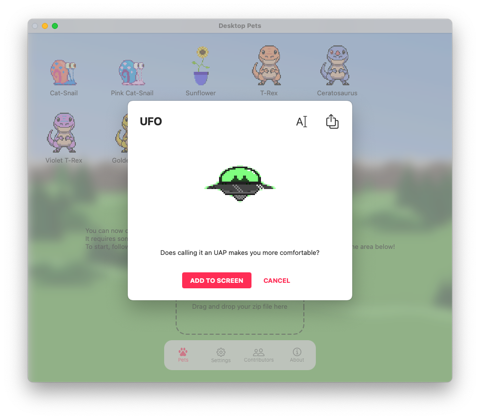

# Custom Pets

**Work in progress, I might finish next weekend!**

You can now create your own custom pets!

## TLDR;
1. Modify or create your own sprite files
1. Create a Json file describing your pet behaviors
1. Zip everything
1. Enable creator mode using cheat code `Set!creatorMode=true`
1. Drag and drop the zip in the app

## Species Definition
A `Species` is defined by the following: 
* A unique id
* A list of Capabilities
* A list of Animations
* Other attributes, such as speed

All of these need to be defined in a json file, for example:

``` json
{
  "id": "ape",
  "movementPath": "walk",
  "speed": 0.7,
  "dragPath": "drag",
  "fps": 10,
  "capabilities": [
    "AnimatedSprite",
    "AnimationsProvider",
    "AutoRespawn",
    "BounceOnLateralCollisions",
    "FlipHorizontallyWhenGoingLeft",
    "LinearMovement",
    "PetsSpritesProvider",
    "RandomAnimations",
    "Rotating"
  ],
  "animations": [
    {
      "id": "front",
      "position": {
        "fromEntityBottomLeft": {}
      },
      "requiredLoops": 5
    },
    ...
  ]
}
```

Complete json files for all original species can be found [here](https://github.com/curzel-it/pet-therapy/tree/main/Species).

### Capabilities
Capabilities are behaviors that can be attached to a Pet to manipulate its state on update - some names are pretty self-explanatory, such as `BounceOnLateralCollisions` or `FlipHorizontallyWhenGoingLeft`.

While I recommend using the set of capabilities in the example above for most pets, not all species have the same capabilities:
* Grumpy Cat has a special one called `GetsAngryWhenMeetingOtherCats`
* Snails are missing `BounceOnLateralCollisions` and has a special one called `WallCrawler`

### Animations
Animations are picked randomly from the list at a random interval.

Each animation has: 
* `id` which determinates the sprite to be rendered
* `position` 
* `size` see sloth's [lightsaber animation](https://github.com/curzel-it/pet-therapy/blob/main/Species/sloth.json)
* `requiredLoops` number of times the animation will be repeated

Each species needs to have at least a `front` animation, which is loaded in homepage and pet details.

### Other properties
* `movementPath` determinates which sprite set should be used to render the movement animation (usally `walk` or `fly`)
* `dragPath` determinates which sprite set should be used to render the "falling" and "drag" animations (usally `drag` or `front`)
* `speed` is self-explanatory
* `fps` animations in some species are *slower* (such as snail or the sunflower), so no need to render them as fast

## Sprites
**Filenames are critical and case-sensitive**

Each animations is composed of multiple sprites, each in a dedicated `png` image file.

Each file must follow this convention: 

`{species.id}_{animation.id}-{index}.png`.

Indeces can be either 0-based or 1-based, but need to follow an incremental and sequential order.

For example:
* `ape_front-1.png`
* `ape_front-2.png`
* `ape_front-3.png`
* `ape_front-4.png`
* `ape_walk-0.png`
* `ape_walk-1.png`
* `ape_walk-2.png`
* `ape_walk-3.png`
* `sloth_swag_lightsaber-0.png`
* ...

## App Features
### Export
Click on any pet to show its details, then click the button in the top right.


### Import
Scroll down the list of pets and drop in the designated area.
